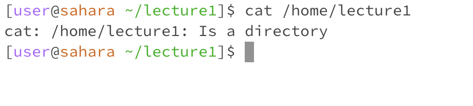
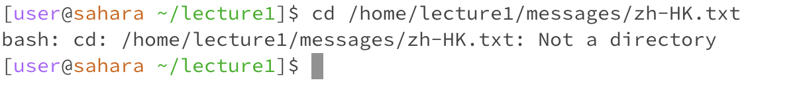
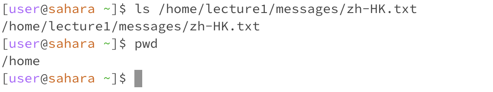
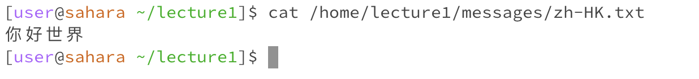

## Lab Report 1
1. The working directory The `cd` command didn't produce any output because the command is used to navigate the file system by moving from one directory to another. 

2.
The list command `ls` does not have to specify a directory. It listed the content of the current working directory which is lecture1. 

When there is no arguments, the `cat` command waits for my input and reproduce the same text as I typed in. So when I don't give any argument, the commands would operate on its default behavior.

3. 

4. After using the commands with a path to a directory as an argument, as shows by the `cat` command, /home/lecture1 is the current working directory so all the files and directories in the /home/lecture1 directory is being listed by the `ls` command.

5. 
6. 
7. 
8. 
9. 

I created the zh-HK.txt file which contains the hello world in Chinese. After using the command with a path to a file as an argument, it looks like the `cd` command is showing an error saying that it is not a directory. While the output of `ls` command is the information of the file and the output of `cat` command is the content of the file.   
