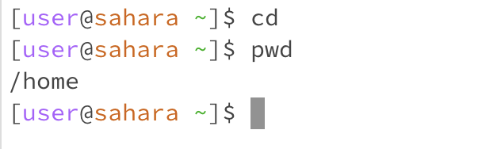
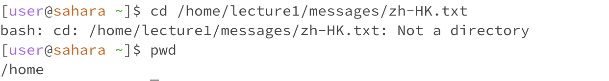
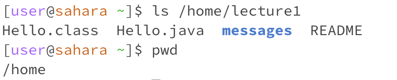
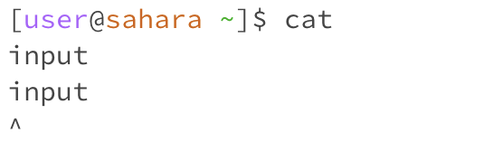

## Lab Report 1
1. It is not an error. The working directory is `/home`. The `cd` command didn't produce any output because the command is used to navigate the file system by moving from one directory to another. When no argument is provided, it takes the user to the home directory.

 

2. This is not an error. With an argument, the working directory is `/home/lecture1`. This changes the current directory from `/home` to `/home/lecture1`. 

 

3. This is an error. The working directory is `/home`. The `cd` command does not work with file paths, only directories, so it produces error message.

4. This is not an error. The working directory is `/home`. With no arguments, it lists the contents of the current directory, which is `lecture1` in this case.   

5. This is not an error. The working directory is `/home/lecture1`. With the argument being a directory, it lists the contents of the /home/lecture1 directory, which are `Hello.class`, `Hello.java`, `messages` and `README`. 

6. This is not an error. The working directory is `/home`. With the argument being a file, it simply lists the file `/home/lecture1/messages/zh-HK.txt` if it exists.

7. This is not an error. The working directory is `/home`. Without arguments, `cat` is usually used to read from standard input.Tthe `cat` command waits for my input and reproduce the same text as I typed in.

8. This is an error. The working directory is `/home/lecture`. With an argument being a directory, it typically returns an error saying it is a directory because `cat` is used for files, not directories.

9. This is not an error. The working directory is `/home/lecture1`. With an argument being a file, the command `cat` displays the contents of the file. 

