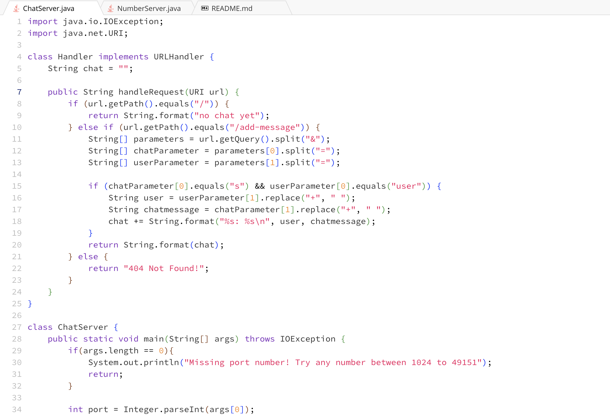
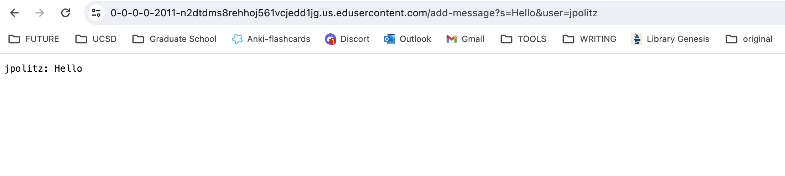
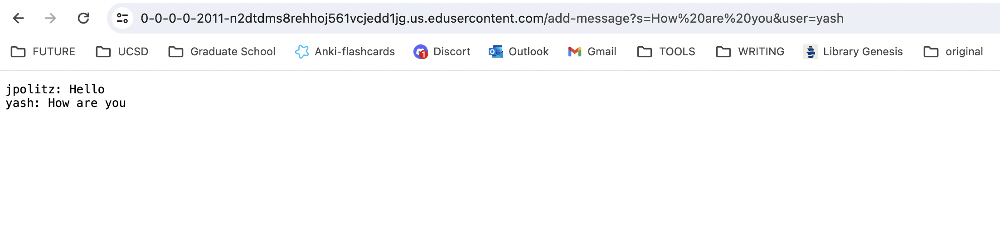
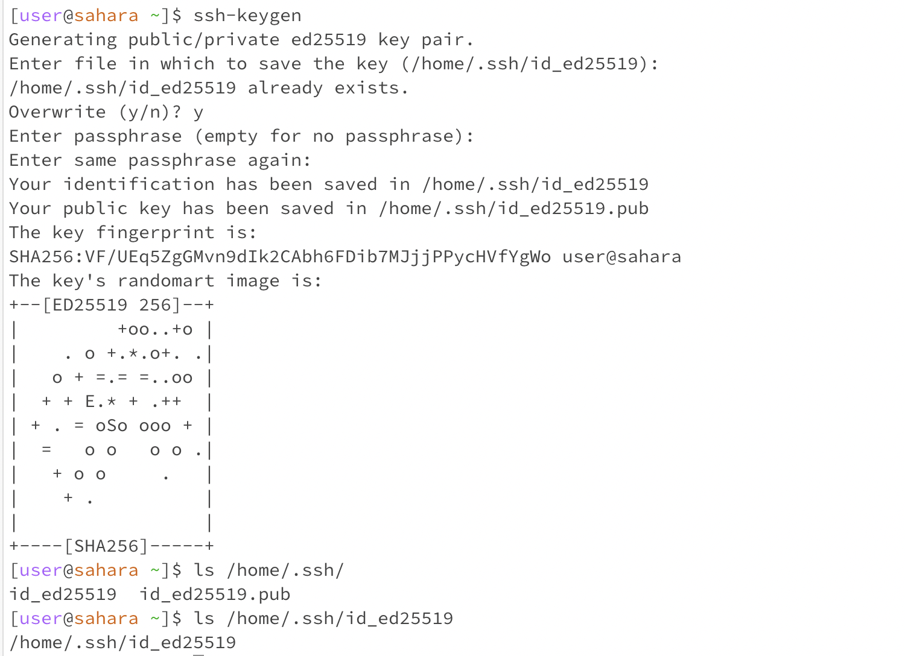
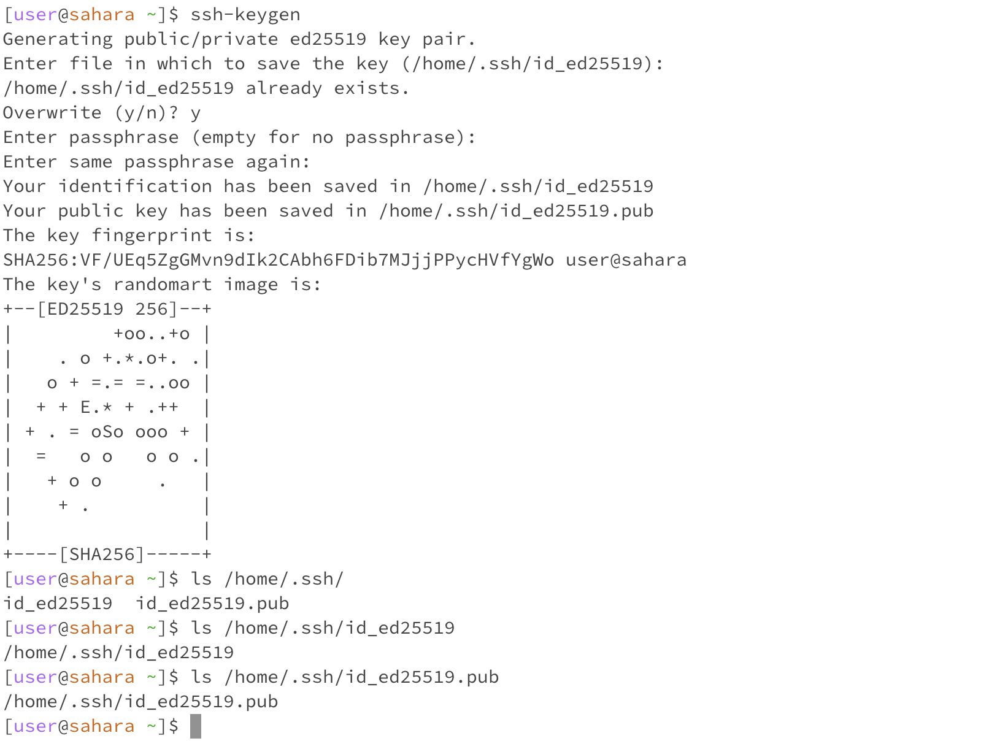
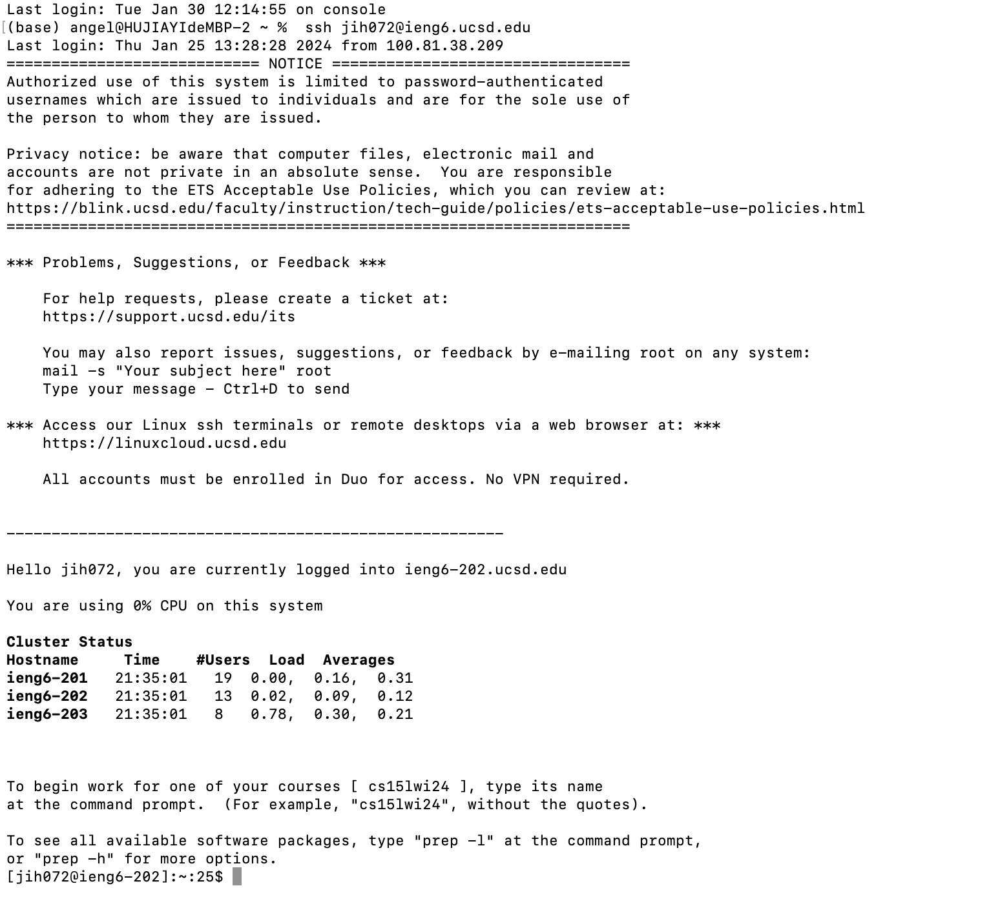

# Lab Report 2
# Part 1
## Code for my ChatServer:

---
## First screenshot: 

1. The method `handleRequest(URI url)` of the `Handler` class is called.
2. - Relevant Arguments: The `URI url` argument is passed to the `handleRequest` method. It contains the full URI of the request. `url` would be a `URI` object representing the string `/add-message?s=Hello&user=jpolitz`.
   - Relevant Field Values: The `String chat` field in the `Handler` class: Before the request, it holds the current state of the chat, which shows a message of `"no chat yet"`.
3. Yes, the value changes. The method checks the path of the URI. In this case, it matches `/add-message`. It then splits the query part of the URI `s=Hello&user=jpolitz` into parameters. It then split to extract the user `"jpolitz"` and the message `"Hello"`. The `chat` field is updated by appending this new message. The `chat` now becomes `"jpolitz: Hello\n"`. The method returns the updated `chat` content, which now includes the newly added chat. As a result, after this specific request, the `chat` field’s value changes from its initial state to include the new chat message, formatted as `"jpolitz: Hello"`, followed by a newline character.

---
## Second screenshot: 

1. The method `handleRequest(URI url)` of the `Handler` class is called.
2. - Relevant Arguments: The `URI url` contains the URI of the request.`url` represents the string `/add-message?s=How are you&user=yash`.
   - Relevant Field Values: The `String chat` field in the `Handler` class: Before the request, it holds the current state of the chat. If this is the first message, it would be an empty string ("").
3. Yes, the value changes. Upon receiving `/add-message?s=How are you&user=yash`, the `chat` field changes from its initial state by appending `"yash: How are you\n"`. And since it initially contained `"jpolitz: Hello\n"`, it now holds `"jpolitz: Hello\nyash: How are you\n"`.

---
# part 2
1. The absolute path to the private key for my SSH key: `/home/.ssh/id_ed25519`.

2. The absolute path to the public key for my SSH key: `home/.ssh/id_ed25519.pub`.

3. A screenshot for a terminal interaction where I logged into my ieng6 account without being asked for a password

---
# part 3
I learned how to use `ssh` and connected to the server `ieng6` for the first time. I also learned how to clone into the repository I needed to be in. What's more, I learned that the port number dentifies a specific port that the web server runs on. 
