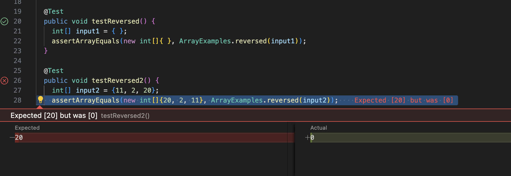

# Lab Report 3
# Part 1 - Bugs
## 1. Failure-Inducing Input for `reverseInPlace`
```
@Test
public void testReversed2() {
    int[] input2 = {11, 2, 20};
    assertArrayEquals(new int[]{20, 2, 11}, ArrayExamples.reversed(input2));
  }
```

## 2. An input that doesn't induce a failure for `reverseInPlace`:
```
@Test 
public void testReversed() {
    int[] input1 = { };
    assertArrayEquals(new int[]{ }, ArrayExamples.reversed(input1));
  }
```

## 3. The symptom:


## 4. The bug:
## before change:
```
  static int[] reversed(int[] arr) {
    int[] newArray = new int[arr.length];
    for(int i = 0; i < arr.length; i += 1) {
      arr[i] = newArray[arr.length - i - 1];
    }
    return arr;
  }
```
## after change:
```
  static int[] reversed(int[] arr) {
    int[] newArray = new int[arr.length];
    for(int i = 0; i < arr.length; i += 1) {
      newArray[i] = arr[arr.length - i - 1];
    }
    return newArray;
  }
```
## why the fix addresses the issue:
In the initial version, it incorrectly assigned values to `arr[i]` instead of `newArray[i]`. It should instead fill the `newArray` with the elements from `arr` in reverse order. And then returns the `newArray` instead of the original `arr`.

# Part 2 - Researching Commands
I choose `less`.

## Command 1: -N 
## 1
```
less -N ./technical/911report/chapter-1.txt

1 
2         
3                 
4 "WE HAVE SOME PLANES"
5 
6     Tuesday, September 11...
```
This command opens `chapter-1.txt` from the `./technical/911report` with line numbers displayed. It's useful for referencing specific parts of the 911 report by line number.
## 2
```
less -N ./technical/government/Alcohol_Problems/DraftRecom-PDF.txt

1 
2 
3 
4 
5 Discussion of
6 Draft Recommendations
7 
8 Daniel Hungerford opened the final session of the conference by
9 outlining the group's ultimate task-to create research
10 recommendations from conference deliberations. Before the...
```
This command opens `DraftRecom-PDF.txt` with line numbers displayed. It's useful for referencing specific parts of the government alcohol document by line number.
## Works Cited
"less(1) - Linux man page." GNU Project, n.d., https://man7.org/linux/man-pages/man1/less.1.html.

This is a command I know and I double checked it using this website. 

## Command 2: -I 
## 3
```
less -I ./technical/911report/PREFACE.txt
/RECOMMENDATIONS

We present the narrative of this report and the recommendations that flow from it to
```
The word `recommendations` is found and highlighted. The searche ignore case even if the pattern contains uppercase letters, making it easier to find occurrences of a word, regardless of its case. 

## 4
```
less -I ./technical/911report/CHAPTER-1.txt
/president
        
In Sarasota, Florida, President George W. Bush went for an early morning run.
```
The word `president` is found and highlighted. The searche ignore case even if the pattern contains uppercase letters, making it easier to find occurrences of a word. 
## Works Cited
"less(1) - Linux man page." GNU Project, n.d., https://man7.org/linux/man-pages/man1/less.1.html.

I was wondering how to make the search not care about uppercase letters so I searched up and this command is handy. 

## Command 3: -M
## 5
```
less -M ./technical/911report/PREFACE.txt

./technical/911report/PREFACE.txt lines 1-17/108 12%
```
It shows my current position is 12% out of the whole report. It is useful because it helps navigate a lengthy report becomes easier by giving you a clear indication of your current location within the document.

## 6
```
less -M ./technical/911report/CHAPTER-6.txt

./technical/911report/CHAPTER-6.txt lines 116-132/1898 6%
```
It shows my current position is 6% out of the whole report. It is useful because I may wonder the how long the report is left to read. 
## Works Cited
"less(1) - Linux man page." GNU Project, n.d., https://man7.org/linux/man-pages/man1/less.1.html.

I looked through the web page and I pick this one as it is useful for me. 

## Command 4: -E
## 7 
```
less -E ./technical/911report/CHAPTER-2.txt

(it exits the first time I finished reading the file)
```
It automatically exit the first time it reaches end of the file. It is useful because it helps save my time. 

## 8
```
less -E ./technical/plos/journal.pbio.0020001.txt

(it exits the first time I finished reading the file)
```
It automatically exit the first time it reaches end of the file. I only want to take a quick look at the file and it saves my time.
## Works Cited
"less(1) - Linux man page." GNU Project, n.d., https://man7.org/linux/man-pages/man1/less.1.html.

I was looking for a handy way to exit the file without doing q and this command looks pretty useful. 


