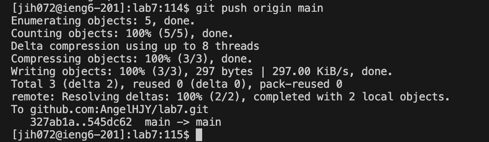

# Lab Report 4

## Step4 Log into ieng6
```
Keys pressed: ssh jih072@ieng6.ucsd.edu <enter>
I logged into my ieng6
```

## Step5 Clone your fork of the repository from your Github account 
```
Keys pressed: git clone git@github.com:AngelHJY/lab7.git <enter>
I git cloned my github ssh
```

## Step6 Run the tests, demonstrating that they fail
```
Keys pressed: bash test.sh <enter>
I did bash to run the test to comfirm that it fails
```

## Step7 Edit the code file to fix the failing test
```
Keys pressed:
cd lab7 <Enter>
vim ListExamples.java <Enter>
 ? index <Enter>
<down><left><left><left><left><left><left>
x i 2
<esc>
:wq!<Enter>

I first cd into lab7 and then I vim into the file that needed to be fixed
I then searched the keyword index using ? index and pressed enter. Then I used down arrow and
pressed the left arrow six times to get the the number that needed to be fixed.
```

## Step8 Run the tests, demonstrating that they now succeed
```
Keys pressed: bash test.sh <enter>
I ran the test again to show that it is now succesful.
```

## Step9 Commit and push the resulting change to your Github account
```
Keys pressed: 
git add ListExamples.java <enter>
git commit -m "fixed the code file" <enter>
git push origin main

I first used add to put the file that I edited in stage and then I commit the change by command git commit.
I chose the message to be "fixed the code file" so that it displayed what I did with the file.
Then I pushed the change to the github by git push. 
```


