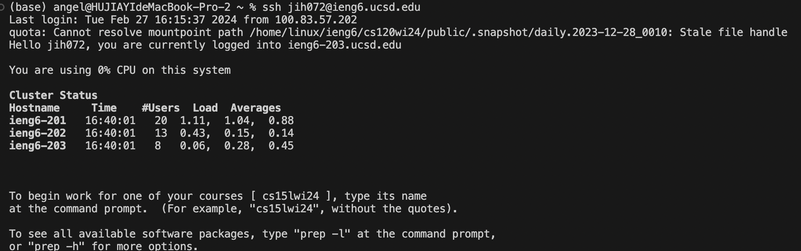
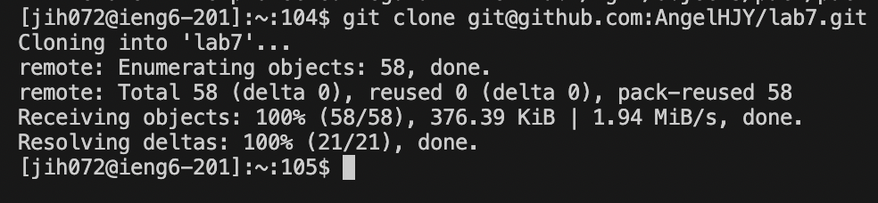

# Lab Report 4

## Step4 Log into ieng6
```
Keys pressed: ssh jih072@ieng6.ucsd.edu <enter>
```

## Step5 Clone your fork of the repository from your Github account 
```
Keys pressed: git clone git@github.com:AngelHJY/lab7.git <enter>
```

## Step6 Run the tests, demonstrating that they fail
```
Keys pressed: bash test.sh <enter> 
```

## Step7 Edit the code file to fix the failing test
```
Keys pressed:
cd lab7 <Enter>
vim ListExamples.java <Enter>
 ? index <Enter>
<right><right><right><right>
x i 2
<esc>
:wq!<Enter>
```

## Step8 Run the tests, demonstrating that they now succeed
```
Keys pressed: bash test.sh <enter>
```

## Step9 Commit and push the resulting change to your Github account
```
Keys pressed: 
git add ListExamples.java <enter>
git commit -m "fixed the code file" <enter>
git push origin main
```


