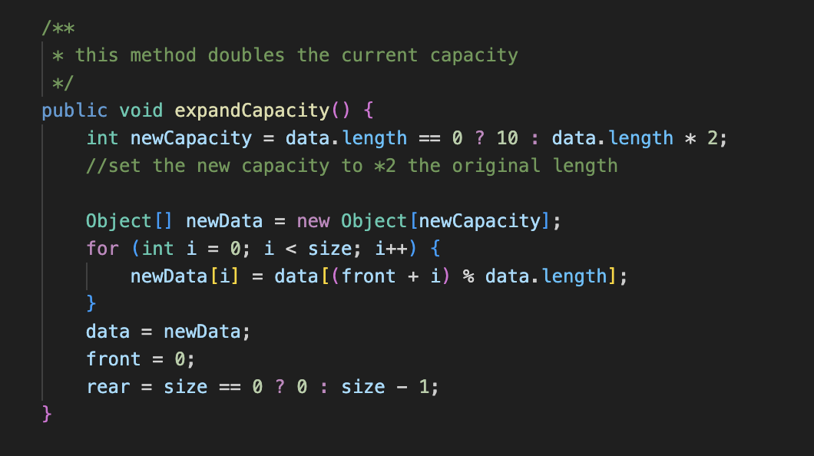

# Lab Report 5

## Part 1 - Debugging Scenario
## 1 original post
```
Symptom: The first image is showing a failed test case in Junit. 

Description of a guess at the bug: It might be a bug in the code of the second image.
It suggests that after an operation, an element in the deque that was expected to be 1 is instead null.
This might related to the condition of the deque when expandCapacity is called.
Given that the error occurs after expandCapacity,
it suggests that the elements are not being copied correctly into the new array.
```


## 2 response
```
Some leading questions: why do you think the element becomes null?
Can you check your logic of the the loop that copies the elements.
Is it iterating through the entire array? is there an issue with the index calculations?
```

## 3 try

```
Description of what the bug is: To fix the bug, I went back to the expand method to see the logic of the loop.
I discovered that it will not include the element at index size - 1
and this is what causes the last element of the array to be missing in the new array after expansion.
```

## 4 all the information needed about the setup
```
1. The file & directory structure needed:
```

```
2. the content of each file before fixing the bug: it has too many files and
it is not very possible to copy and paste all of them here. I have provided the basic setup of what files are included. 
```
```
3. The full command line (or lines) you ran to trigger the bug: bash test.sh to run the Junit test:
javac -cp ../libs/junit-4.13.2.jar:../libs/hamcrest-2.2.jar:. PublicTester.java
java -cp ../libs/junit-4.13.2.jar:../libs/hamcrest-2.2.jar:. org.junit.runner.JUnitCore PublicTester
```
```
4. A description of what to edit to fix the bug:it is included in the step3
```

## Part2 - Reflection
I learned how to use bash and scripting which is very interesting and convenient. The use of jdb is also a new thing to me. I learned how to use jdb with `suspend` to pause the program and show the stack trace during the loop. And how it can help me find which test is triggering the infinite loop and which line the program stopped on when the program was suspended. 


